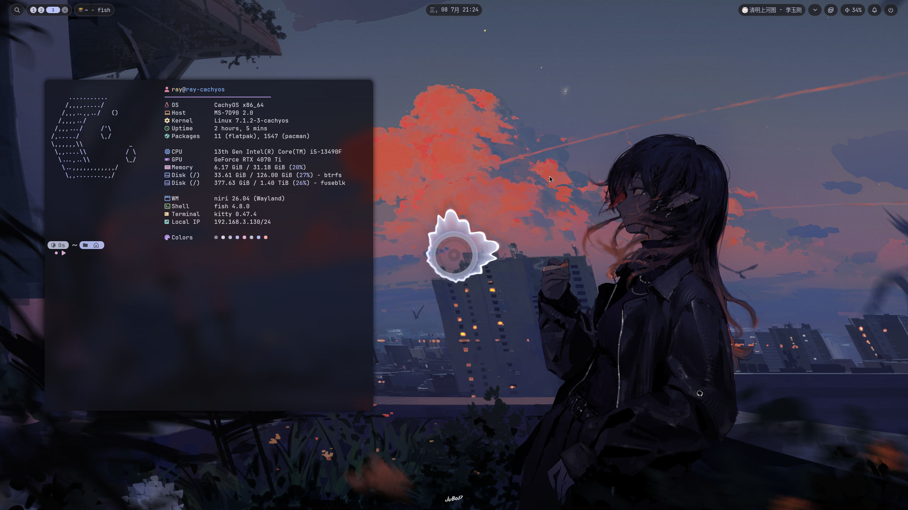

# 🌌 NyxNiri - Niri & Noctalia V5 Desktop Setup

<p align="center">
  
  
  
  
</p>

<p align="center">
  <a href="#english">English</a> • 
  <a href="#chinese">简体中文</a>
</p>

---

<div id="english"></div>

## 🌌 Overview

My personal dotfiles for the **Niri** scroll-tiling window manager and the **Noctalia V5** shell, running on Arch Linux / CachyOS. Features automated theme sync, Material You colors, and custom terminal utilities.



---

## 📂 Repository Structure

```text
.
├── install.sh              # Installation script (manages backups, dependencies, and copying configs)
├── v1(forDMS)/             # [Archived] Old Dank Material Shell (DMS) configuration
└── v2(forNoctaliaV5)/      # [Active] Latest Noctalia V5 configuration
    ├── niri/               # Niri window manager config
    ├── noctalia/           # Noctalia V5 config & theme sync scripts
    ├── kitty/              # Kitty terminal configuration
    ├── fish/               # Fish shell config (autostart, custom aliases, etc.)
    ├── fastfetch/          # Fastfetch configuration
    └── starship.toml       # Starship prompt configuration
```

*Note: Wallpapers are deployed to `~/图片/Wallpapers`.*

---

## ✨ Features

* **Video Wallpapers**: Play video wallpapers via `mpvpaper`, hooked with Noctalia to extract terminal color schemes from video frames dynamically.
* **Theme Sync (`theme-sync.sh`)**: Syncs GSettings and GTK3/GTK4 themes automatically when switching wallpapers or light/dark mode.
* **Fish Shell Setup**: Built-in proxy checker (`proxy_status`), custom helper aliases, and package helper menus.
* **Kitty Terminal**: Windows-style text selection/shortcuts (Ctrl+C/V, Ctrl+Backspace) and smooth cursor effects.

---

## 🚀 Installation

An interactive script is provided to safely back up existing configurations and deploy configs:

```bash
# Clone the repository
git clone git@github.com:ech678/NyxNiri.git ~/NyxNiri

# Run the installer
cd ~/NyxNiri
./install.sh
```

---

<div id="chinese"></div>

## 🌌 项目概述

基于 **Niri** 滚动平铺窗口管理器与 **Noctalia V5** 桌面套件的个人配置，运行在 Arch Linux / CachyOS 上。集成了 Material You 壁纸色彩提取、全局自动主题同步和终端环境优化。

---

## 📂 目录结构

```text
.
├── install.sh              # 安装脚本 (包含备份、依赖管理、复制部署和环境诊断)
├── v1(forDMS)/             # 旧版 DMS 配置 (已归档)
└── v2(forNoctaliaV5)/      # 当前使用的 Noctalia V5 配置
    ├── niri/               # Niri 窗口管理器配置
    ├── noctalia/           # Noctalia V5 桌面组件与主题同步钩子
    ├── kitty/              # Kitty 终端配置 (包含快捷键与光标特效)
    ├── fish/               # Fish shell 配置 (自启动、色彩应用及实用别名)
    ├── fastfetch/          # Fastfetch 信息看板
    └── starship.toml       # Starship 终端提示符
```

*说明：壁纸文件会复制部署到 `~/图片/Wallpapers`。*

---

## ✨ 核心特性

* **动态视频壁纸**：使用 `mpvpaper` 播放视频壁纸，并与 Noctalia 的壁纸切换钩子配合，实现自动生成帧缩略图并提取终端色彩。
* **全局主题同步 (`theme-sync.sh`)**：切换壁纸或明暗模式时，自动刷新 GSettings 和 GTK 3.0/4.0 的 `settings.ini` 配置文件。
* **Fish Shell 终端优化**：提供 `proxy_status`（测速与地理位置查询）、基于 Shelly 的常用包管理别名，以及自定义的别名说明菜单。
* **Kitty 终端优化**：配置了 Windows 风格快捷键（Ctrl+C/V 复制粘贴、Ctrl+Backspace 词级别删除）和渐变光标轨迹。

---

## 🚀 部署指南

项目提供了一个交互式脚本，可以安全备份当前配置并进行复制部署：

```bash
# 克隆仓库
git clone git@github.com:ech678/NyxNiri.git ~/NyxNiri

# 运行安装脚本
cd ~/NyxNiri
./install.sh
```

---

## 🎨 视觉与细节
* **窗口管理器**: Niri
* **状态栏 & 桌面组件**: Noctalia V5 Shell
* **默认 Shell**: Fish Shell + Starship Prompt
* **推荐字体**: JetBrains Mono / Noto Sans CJK SC
